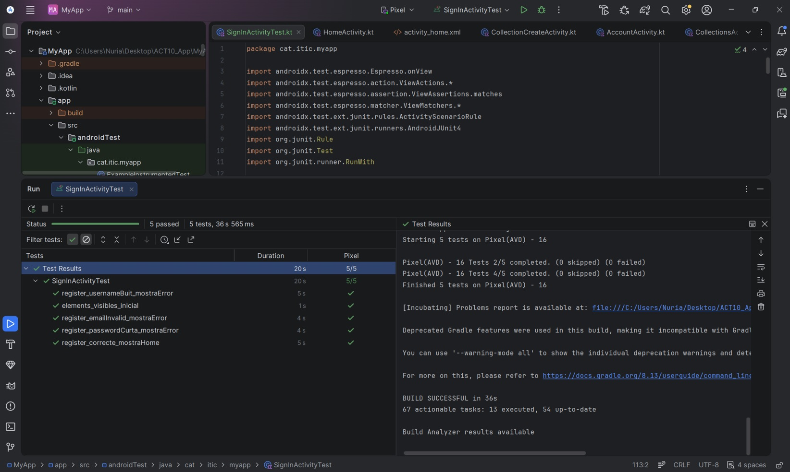
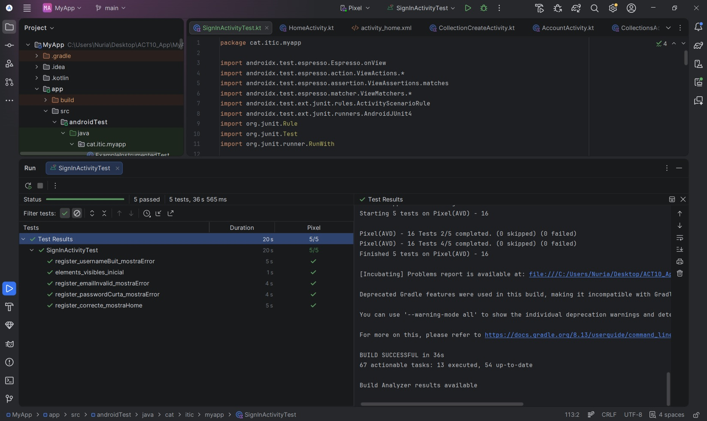

# Activitat 11 - Testing

## Objectiu

Dissenyar un pla de proves i implementar-les sobre la pantalla de registre d’usuaris d’una aplicació Android.

Camps dels quals es fan les proves:

- Nom d’usuari  
- Correu electrònic  
- Contrasenya  
- Confirmació de contrasenya  

S’han implementat proves unitàries i proves d’integració per dur a terme aquestes proves, amb LiveData i les Espresso.

### Proves unitàries i el que validen:

- Nom d’usuari  
- Correu electrònic  
- Contrasenya  
- Confirmació de contrasenya  
- Estat global del formulari  

### Proves d’integració i el que validen:

- Introducció de text  
- Click en botons  
- Validació d’errors  
- Comprovació d’elements visibles  

---

## Proves unitàries (ViewModel)

| Nom de la prova | Tipus | Entrades | Resultat esperat |
|----------------|------|----------|------------------|
| Username buit | Unitària | `""` | "Username is required" |
| Username curt | Unitària | `"ab"` | "Minimum 3 characters" |
| Email invàlid | Unitària | `"email"` | "Invalid email" |
| Password curta | Unitària | `"123"` | "Minimum 8 characters" |
| Password sense número | Unitària | `"password"` | "Must contain at least one number" |
| Confirm password buit | Unitària | `""` | "Confirm password required" |
| Passwords no coincideixen | Unitària | `"12345678", "1234"` | "Passwords do not match" |
| Formulari correcte | Unitària | dades correctes | `formValid = true` |

---

## Proves d’integració (Espresso)

| Nom de la prova | Tipus | Entrades | Resultat esperat |
|----------------|------|----------|------------------|
| UI inicial visible | Integració UI | Obertura pantalla | Tots els camps visibles |
| Registre correcte | Integració UI | Dades vàlides | Navegació correcta |
| Error username buit | Integració UI | Username buit | Missatge d’error |
| Error email invàlid | Integració UI | Email incorrecte | Missatge d’error |
| Error password curta | Integració UI | Password < 8 | Missatge d’error |

---

## Resultats

✔ Proves unitàries: correctes  
✔ Proves d’integració: correctes  
✔ Validació de formulari: funcional  
✔ Interfície d’usuari: estable  

No s’han detectat errors en el comportament de l’aplicació.

---

## Conclusions

Les proves no han donat errors i tenen en compte filtres i condicions implementades sobre el registre d'un usuari nou a l'aplicació.

---
